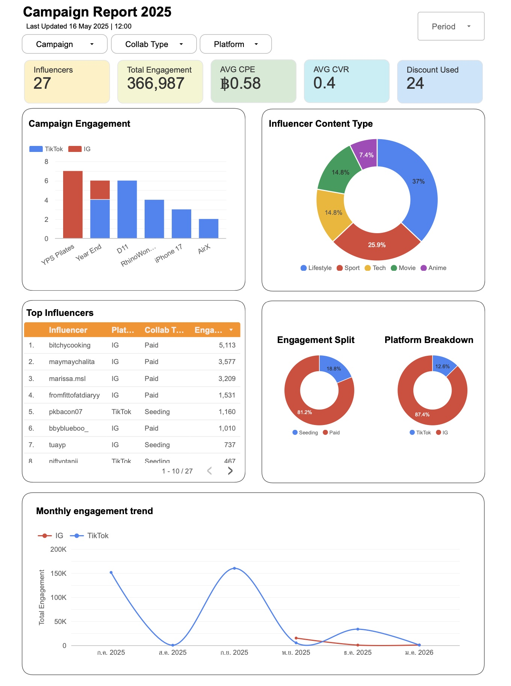

# 📊 Influencer Campaign Performance Analysis 2025

> Multi-platform influencer marketing analysis across TikTok & Instagram — uncovering engagement patterns, ROI efficiency, and content strategy insights.

---

## 📌 Project Overview

This project analyses a real-world influencer marketing campaign involving **27 creators** across **TikTok and Instagram**, spanning **5 campaign periods** in 2025. The goal was to evaluate campaign effectiveness, identify top-performing influencers, and surface actionable insights for future budget allocation.

---

## 🎯 Key Findings

- 📈 **366,987 total engagements** recorded across all campaigns and platforms
- 💰 **Average CPE of ฿0.58** — indicating strong cost efficiency across paid and seeding collaborations
- 🏆 **Paid Instagram collaborations drove 81.2%** of total engagement, with top 4 performers all on IG
- 🚀 **TikTok recorded two viral spikes** (~150K each in July & September 2025), highlighting burst campaign potential
- 🎨 **Lifestyle (37%)** was the dominant content niche, followed by Sport (25.9%) and Tech/Movie (14.8% each)
- 🔁 **Average CVR of 0.4** with 24 discount code usages tracked

---

## 📂 Project Structure
**Dashboard**
 [View Interactive Dashboard on Looker Studio](https://datastudio.google.com/reporting/6e5413c5-2f1b-4fe0-a783-ec0d65f1a286) 

**Visuals**
    

---

## 🛠️ Tools & Skills Used

| Category | Tools |
|---|---|
| Data Analysis | SQL|
| Visualisation | data studio / Power BI |
| Dashboard | HTML |
| Version Control | Git & GitHub |
| Reporting | Markdown, Data Storytelling |

---

## 📊 Dashboard Preview

The interactive dashboard includes:
- KPI summary cards (Influencers, Total Engagement, CPE, CVR, Discount Used)
- Campaign engagement by project (TikTok vs Instagram)
- Influencer content type breakdown (donut chart)
- Engagement split by collaboration type (Paid vs Seeding)
- Monthly engagement trend line chart
- Top 8 influencer ranking table

---

## 💡 Business Recommendations

1. **Prioritise Paid IG collaborations** for campaigns targeting consistent, high engagement
2. **Use TikTok for launch bursts** — ideal for product drops and time-sensitive promotions
3. **Focus on Lifestyle creators** as the dominant and most engaged niche
4. **Seeding strategy on TikTok** (e.g. pkbacon07) shows cost-effective reach potential worth scaling
5. **Maintain CPE below ฿1.00** as a benchmark for future campaign negotiations

---

## 👤 About

Made by **Chanatinard Sinjiratornkul** — Data Analyst passionate about marketing analytics and data storytelling.

- 🔗 [LinkedIn](https://www.linkedin.com/in/chanatinard-sinjiratornkul-00a52b200?utm_source=share_via&utm_content=profile&utm_medium=member_ios)
- 📧 chanatinard.si@gmail.com

---

*Last updated: May 2026*
